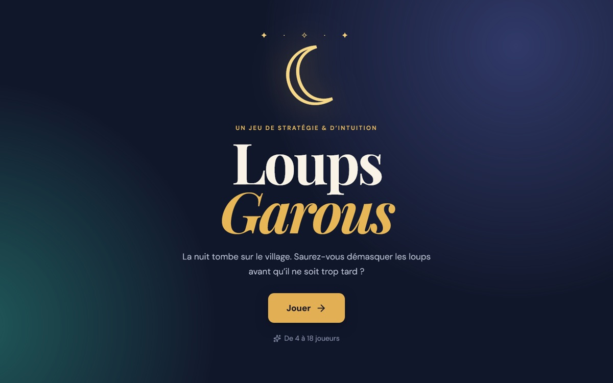

# Loups Garous

Une interface web pour préparer une partie de **Loups-Garous** à jouer entre amis. Le narrateur de la partie peut: ajouter les participants, choisir les rôles à jouer, distribuer les cartes secrètes, jouer des fonds sonores pour une meilleur ambiance.

## Demo

Lancer la [démo](https://loups-garoux-irl.vercel.app "Loups-garoux by Henri Issoufou") en ligne pour y jouer.

## Fonctionnalités

- Ajout de 4 à 18 participants.
- Sélection des rôles jouables.
- Rôles **Villageois** et **Loup-garou** toujours inclus.
- Choix du nombre de loups-garous.
- Ordre de passage et attribution des rôles aléatoires.
- Cartes secrètes à retourner, joueur par joueur.
- Interface responsive avec une ambiance nocturne.

## Technologies

- React
- TypeScript
- Vite
- Lucide React

## Lancer le projet en local

### Prérequis

Installe [Node.js](https://nodejs.org/) (version 20 ou plus récente) et `pnpm` :

```bash
npm install -g pnpm
```

### Installation

```bash
pnpm install
```

### Développement

```bash
pnpm dev
```

Ouvre ensuite l’adresse affichée dans le terminal, généralement `http://localhost:5173`.

### Créer la version de production

```bash
pnpm run build
```

Les fichiers prêts à publier seront créés dans le dossier `dist/`.

## Déploiement

Le projet peut être hébergé facilement sur [Vercel](https://vercel.com/) ou [Render](https://render.com/).

| Réglage                 | Valeur           |
| ----------------------- | ---------------- |
| Commande d’installation | `pnpm install`   |
| Commande de build       | `pnpm run build` |
| Dossier de publication  | `dist`           |

## Structure du projet

```text
src/
├── Components/       # Les écrans et composants visuels
├── data/             # La liste des rôles disponibles
├── types/            # Les types TypeScript
├── utils/            # Mélange et distribution des rôles
├── assets/           # fichiers additionnels (autio, image, etc)
├── App.tsx           # État général et navigation entre les écrans
├── main.tsx          # Point d’entrée React
└── styles.css        # Styles de l’interface
```

## Déroulé de l’application

1. L’utilisateur arrive sur l’écran d’accueil.
2. Il ajoute les participants et choisit les rôles de la partie.
3. Il définit le nombre de loups-garous.
4. Les joueurs découvrent leur rôle à tour de rôle, dans un ordre aléatoire.
5. La partie peut commencer.

## Dépannage

Si Windows indique qu’un fichier de `node_modules` est utilisé ou verrouillé, arrête le serveur de développement avec `Ctrl+C`, ferme les terminaux qui utilisent le projet, puis relance :

```bash
pnpm install
```
